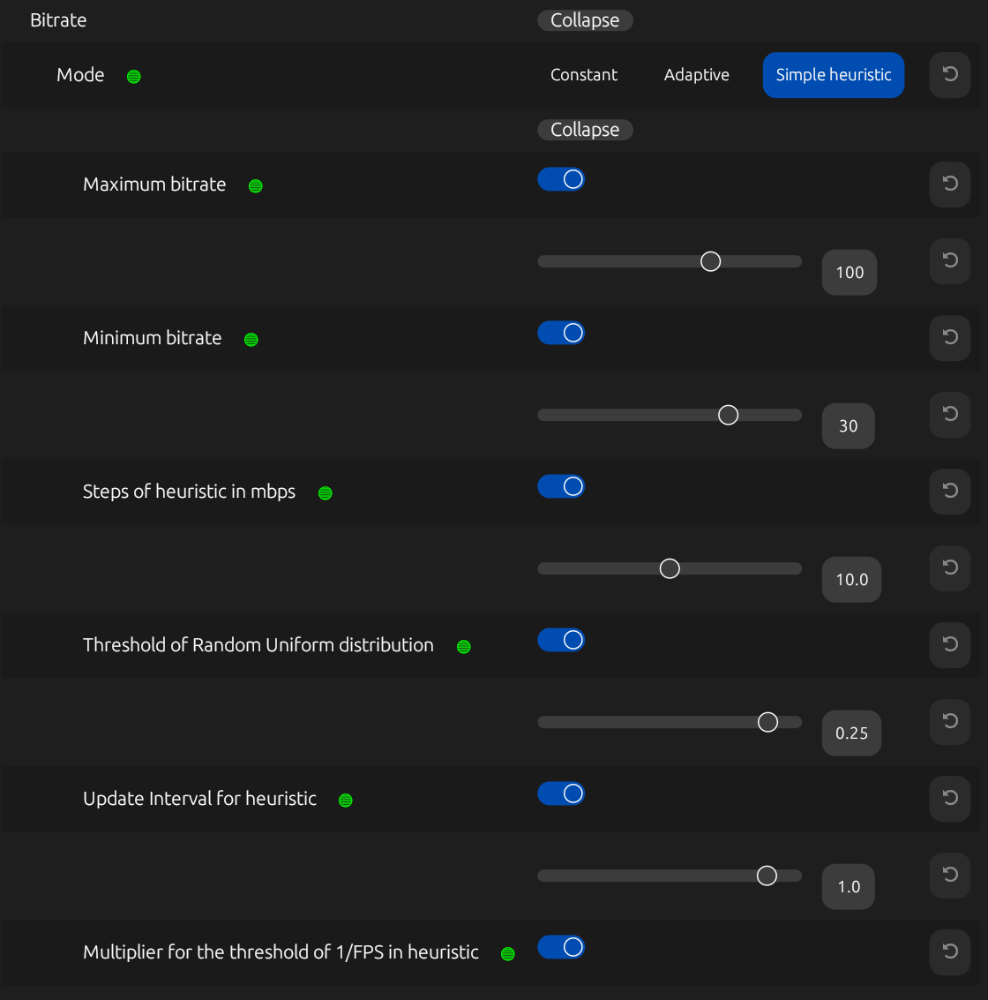
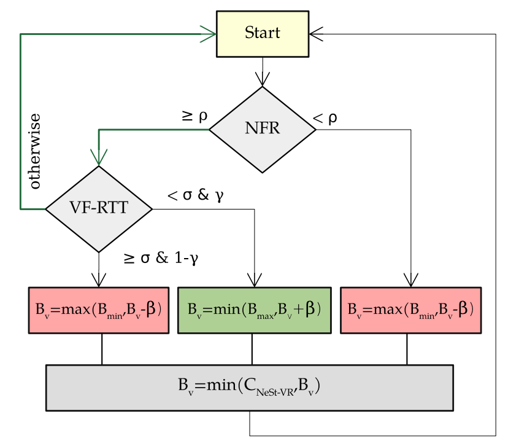

# ALVR - Air Light VR - Wireless Networking UPF

This **fork of [ALVR v20.6.0](https://github.com/alvr-org/ALVR)** introduces several enhancements to ALVR for monitoring and optimizing VR streaming performance. 

In particular, our project integrates **additional metrics** to characterize the network state during streaming, providing insights into video frame (VF) delivery and network performance. Our metrics are logged in the `session_log.txt` file when the `Log to disk` setting is enabled and are also displayed in real time on the `Statistics` tab of the ALVR dashboard:

<table style="width:100%; text-align:center;">
  <tr>
    <td></td>
    <td></td>
  </tr>
</table>

Our project also implements the **Network-aware Step-wise ABR algorithm (NeSt-VR)**, an Adaptive BitRate (ABR) algorithm designed to optimize streaming quality based on real-time network conditions. 

  

This algorithm is implemented as a new bitrate mode in ALVR, named `NeSt vr`:

For a comprehensive validation of several metrics and a detailed introduction and evaluation of the NeSt-VR algorithm, please refer to our paper:  **["Experimenting with Adaptive Bitrate Algorithms for Virtual Reality Streaming over Wi-Fi"](https://arxiv.org/abs/2407.15614)**.

## Added metrics overview 

> **Note:** Our client-side reported statistics —essential for obtaining the added metrics— are sent from the head-mounted diplay (HMD) to the server over TCP immediately after the client receives a VF. This feedback is received at the server significantly sooner than ALVR’s native statistics packet, which is delayed until the VF is ready
for display

### Time-related metrics
* **Client-side frame span** (`frame_span_ms` in `GraphNetworkStatistics`): time interval between the reception of the first packet to the reception of the last packet of a VF

* **Frame inter-arrival time** (`frame_interarrival_ms` in `GraphNetworkStatistics`): time interval between
the reception of the last packet of a VF and the last packet of the previous received VF

* **Video Frame Round-Trip Time (VF-RTT)** (`rtt_ms` in `GraphNetworkStatistics`): time it takes for a complete VF to travel from the server to the client and for our supplementary UL packet —promptly sent upon the complete reception of the VF— to reach the server

### Reliability metrics 
* **Packets lost** (`shards_lost` in `GraphNetworkStatistics`): number of packets lost in the interval between two VF receptions

* **Packets duplicated** (`shards_duplicated` in `GraphNetworkStatistics`): number of packets duplicated in the interval between two VF receptions

* **Frames skipped** (`frames_skipped` in `GraphNetworkStatistics`): number of VFs lost prior to decoding, i.e., after network transmission due to packet losses or significant delays

* **Frames dropped** (`frames_dropped` in `GraphStatistics`): number of decoded VFs lost before visualization

### Data rate metrics 
* **Instantaneous video network throughput** (`instant_network_throughput_bps` in `GraphNetworkStatistics`): rate at which video data is received by the client, measured in the interval between two VFs receptions

* **Peak network throughput** (`peak_network_throughput_bps` in `GraphNetworkStatistics`): ratio between the VF’s size and its client-side frame span, used in NeSt-VR to estimate the network capacity

### Network Stability metrics
* **VF jitter** (`frame_jitter_ms` in `GraphNetworkStatistics`): variation in VF time deliveries, computed as the sample standard deviation of frame inter-arrival times 

* **Video packet jitter** (`interarrival_jitter_ms` in `GraphNetworkStatistics`): variability in video packet arrival times as defined in [RFC 3550](https://datatracker.ietf.org/doc/html/rfc3550)

* **Filtered one-way delay gradient** and **One-way delay gradient** (`filtered_ow_delay_ms` and `ow_delay_ms`, respectively, in `GraphNetworkStatistics`) : rate of change in one-way delay (OWD) between two consecutive VFs, smoothed using a Kalman filter
as described in ["Analysis and design of the google congestion control for web real-time communication (WebRTC)"](https://dl.acm.org/doi/10.1145/2910017.2910605) and a state noise variance of $10^{−7}$

## NeSt-VR overview

NeSt-VR applies a hierarchical decision-making process, operating every $\tau$ seconds and progressively adjusting the target bitrate ($B_v$) —initially set to ($B_0$) Mbps— in $\beta$ Mbps steps to avoid significant video quality shifts that may disrupt the user’s QoE. NeSt-VR uses the Network Frame Ratio (NFR) and VF-RTT —averaged over an $n$-sample sliding window ($\overline{\;\centerdot\;}$)— as inputs, adjusting the bitrate if their values surpass configurable thresholds ($\rho$ and $\sigma$, respectively). The target bitrate is also constrained within the configured maximum and minimum bitrate limits ($B_{\max}$ and $B_{\min}$) and is further upper bounded by $m \cdot C_{\text{NeSt-VR}}$ —with $m \leq 1$— to  ensure the bitrate remains under our estimated network capacity ($C_{\text{NeSt-VR}}$):

> **Note:** NFR is computed as $\overline{\text{fps}_{\rm rx}}/{\overline{\text{fps}_{\rm tx}}}$. $\overline{\text{fps}_{\rm rx}}$ denotes the average frame delivery rate
and $\overline{\text{fps}_{\rm tx}}$ denotes the average frame transmission rate (`network_heur_fps` and `server_fps`, respectively, in `HeuristicStats`)

> **Note:** $\sigma$ is computed as $\varsigma/{\overline{\Delta_{\rm tx}}}$. $\varsigma$ is a configurable parameter and $\overline{\Delta_{\rm tx}}$ denotes the average interval between consecutive VFs transmissions

> **Note:** $\gamma$ serves as a configurable exploration parameter to assess whether higher bitrates can be sustained and moderating the frequency of bitrate adjustments due to high VF-RTTs

> **Note:** `HeuristicStats` event is logged at each NeSt-VR adjustment period, including the considered step size ($\beta$: `steps_bps`), the average interval between consecutive VFs transmissions ($\overline{\Delta_{\rm tx}}$: `frame_interval_s`), the considered ($\overline{\text{NFR}}$: `network_heur_fps`), the considered ($\overline{\text{VF-RTT}}$: `rtt_avg_heur_s`), the considered threshold for NFR ($\rho$: `threshold_fps`), the considered threshold for VF-RTT ($\sigma$: `threshold_rtt_s`), the random value drawn from a uniform distribution in the interval [0, 1] (`threshold_u`), and the requested target bitrate ($B_{\text{v}}$: `requested_bitrate_bps`)

NeSt-VR configurable parameters are outlined in the following table:

|        | |                        |   |
|-------------------|--------|-----------|---------|
| Adjustment Period | $\tau$ | Step Size | $\beta$ |
| Sliding Window Size | $n$    | Estimated Capacity Scaling Factor | $m$     |
| Minimum Bitrate    | $B_{\min}$ | VF-RTT Exploration Probability | $\gamma$ |
| Maximum Bitrate    | $B_{\max}$ | NFR Threshold | $\rho$   |
| Initial Bitrate    | $B_{0}$ | VF-RTT Threshold Scaling Factor | $\varsigma$ |
|        | |                        |   |

## How to build

For detailed requirements, please refer to the [ALVR GitHub repository](https://github.com/alvr-org/ALVR).

To build this fork, follow the installation guide provided in the ALVR wiki, specifically for Windows operating systems: [ALVR Installation Guide](https://github.com/alvr-org/ALVR/wiki/Installation-guide).

For further details on how ALVR works, consult their wiki: [How ALVR Works](https://github.com/alvr-org/ALVR/wiki/How-ALVR-works).

## Support

This project is developed with partial financial support of:

<table>
  <tr>
    <td>
      <picture>
        <!-- Dark mode image -->
        <source srcset="./images/logo_maxr_main_sRGB_light.png" media="(prefers-color-scheme: dark)" />
        <!-- Light mode image -->
        <source srcset="./images/logo_maxr_main_sRGB.png" media="(prefers-color-scheme: light)" />
        <!-- Fallback image -->
        
      </picture>
    </td>
    <td>
      
    </td>
  </tr>
  <tr>
    <td><strong>MAX-R Project (HORIZON)</strong></td>
    <td><strong>Wi-XR Project (PID2021-123995NB-I00)</strong></td>
  </tr>
</table>

