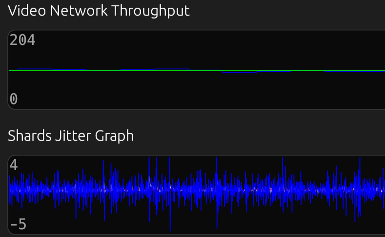
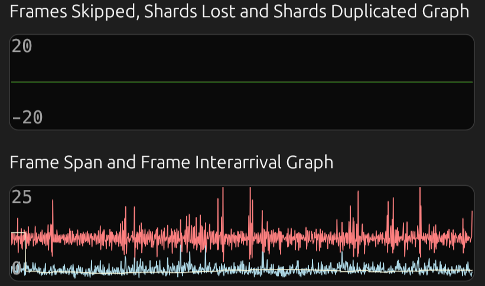
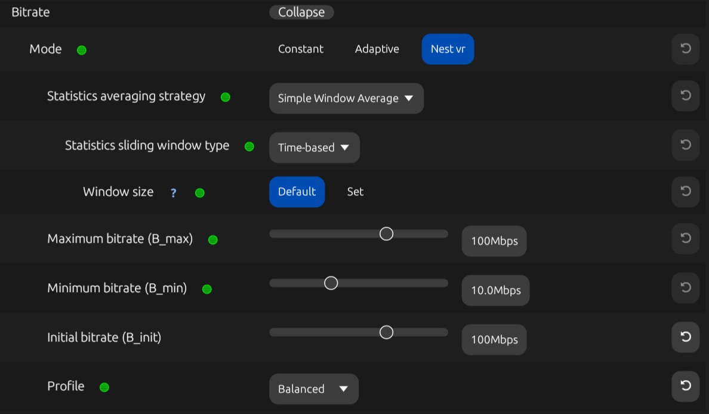
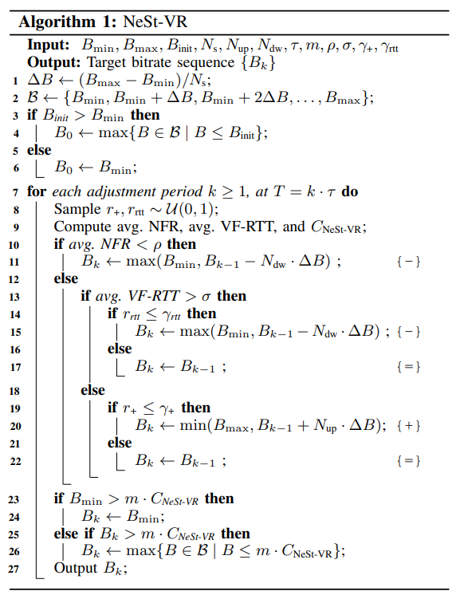

# NeSt-VR 
This **fork of [ALVR v20.6.0](https://github.com/alvr-org/ALVR)**, developed by the Wireless Networking Research Group at UPF, introduces several extensions to ALVR for monitoring VR streaming performance and developing informed Adaptive BitRate (ABR) algorithms.

In particular, our project integrates **additional metrics** to characterize the network state during streaming, providing insights into video frame (VF) delivery and network performance. Our metrics are logged in the `session_log.txt` file when the `Log to disk` setting is enabled and are also displayed in real time on the `Statistics` tab of the ALVR dashboard:

<table style="width:100%; text-align:center;">
  <tr>
    <td></td>
    <td></td>
  </tr>
</table>

Our project also implements the **Network-aware Step-wise ABR algorithm (NeSt-VR)**, an ABR algorithm designed to optimize streaming quality based on real-time network conditions. 

  

This algorithm is integrated as a new bitrate mode in the ALVR dashboard, named `Nest vr`:

For a comprehensive validation of several metrics and a detailed introduction and evaluation of the NeSt-VR algorithm, please refer to our paper:  **["Experimenting with Adaptive Bitrate Algorithms for Virtual Reality Streaming over Wi-Fi"](https://arxiv.org/abs/2407.15614)**.

## Added metrics overview 

> **Note:** Our client-side reported statistics —essential for obtaining the added metrics— are sent from the head-mounted diplay (HMD) to the server over TCP immediately after the client receives a VF. This feedback is received at the server significantly sooner than ALVR’s native statistics packet, which is delayed until the VF is ready
for display

### Time-related metrics
* **Client-side frame span** (`frame_span_ms` in `GraphNetworkStatistics`): time interval between the reception of the first packet to the reception of the last packet of a VF

* **Frame inter-arrival time** (`frame_interarrival_ms` in `GraphNetworkStatistics`): time interval between
the reception of the last packet of a VF and the last packet of the previous received VF

* **Video Frame Round-Trip Time (VF-RTT)** (`rtt_ms` in `GraphNetworkStatistics`): time it takes for a complete VF to travel from the server to the client and for our supplementary UL packet —promptly sent upon the complete reception of the VF— to reach the server

### Reliability metrics 
* **Packets lost** (`shards_lost` in `GraphNetworkStatistics`): number of packets lost in the interval between two VF receptions

* **Packets duplicated** (`shards_duplicated` in `GraphNetworkStatistics`): number of packets duplicated in the interval between two VF receptions

* **Frames skipped** (`frames_skipped` in `GraphNetworkStatistics`): number of VFs lost prior to decoding, i.e., after network transmission due to packet losses or significant delays

* **Frames dropped** (`frames_dropped` in `GraphStatistics`): number of decoded VFs lost before visualization

### Data rate metrics 
* **Instantaneous video network throughput** (`instant_network_throughput_bps` in `GraphNetworkStatistics`): rate at which video data is received by the client, measured in the interval between two VFs receptions

* **Peak network throughput** (`peak_network_throughput_bps` in `GraphNetworkStatistics`): ratio between the VF’s size and its client-side frame span. It serves as a discrete estimate of network bandwidth since ALVR sends each VF in a single burst
### Network Stability metrics
* **VF jitter** (`frame_jitter_ms` in `GraphNetworkStatistics`): variation in VF time deliveries, computed as the sample standard deviation of frame inter-arrival times 

* **Video packet jitter** (`interarrival_jitter_ms` in `GraphNetworkStatistics`): variability in video packet arrival times as defined in [RFC 3550](https://datatracker.ietf.org/doc/html/rfc3550)

* **Filtered one-way delay gradient** and **One-way delay gradient** (`filtered_ow_delay_ms` and `ow_delay_ms`, respectively, in `GraphNetworkStatistics`) : rate of change in one-way delay (OWD) between two consecutive VFs, smoothed using a Kalman filter
as described in ["Analysis and design of the google congestion control for web real-time communication (WebRTC)"](https://dl.acm.org/doi/10.1145/2910017.2910605) and a state noise variance of $10^{−7}$

## NeSt-VR overview

NeSt-VR operates every $\tau$ seconds, progressively adjusting the target bitrate ($B_k \in \mathcal{B}$) —initially set to $B_{init}$ Mbps— in discrete steps of size $\Delta B$ to avoid significant video quality shifts that may disrupt the user’s QoE. The set of available target bitrates ($\mathcal{B}$) depends on the configured minimum bitrate ($B_{\min}$), maximum bitrate ($B_{\max}$), and the number of steps between them ($N_{\text{s}}\in \mathbb{Z}^+$).

At each adjustment period $k\in \mathbb{Z}^+$, occurring at time $T=k\cdot\tau$, NeSt-VR computes the average Network Frame Ratio (NFR) and average VF-RTT —averaged over either a sliding window of $n$ samples, a sliding window of $t$ seconds ($t$ defaults to $\tau$), or an exponentially weighted moving average (EWMA) with weight $\omega$— and applies a hierarchical decision-making process:

* If the average NFR is below its threshold $\rho$, the target bitrate is reduced in $N_{\text{dw}}\in \mathbb{Z}^+$ steps
* If both the average NFR and average VF-RTT surpass their thresholds ($\rho$ and $\sigma$, respectively), with a probability of $\gamma_{\text{rtt}}$, the bitrate is reduced in $N_{\text{dw}}\in \mathbb{Z}^+$ steps; otherwise, it remains consistent
* If the average NFR exceeds $\rho$ and the average VF-RTT is below its threshold $\sigma$, with probability $\gamma_{\text{+}}$, the bitrate is increased in $N_{\text{up}}\in \mathbb{Z}^+$ steps; otherwise, it remains consistent
* Finally, to ensure the bitrate does not exceed the network’s capacity, the target bitrate is upper-bounded by $m \cdot C_{\text{NeSt-VR}}$, with $m \leq 1$. Here, $C_{\text{NeSt-VR}}$ denotes NeSt-VR’s estimated network capacity, computed as the average of the peak network throughput

> **Note:** NFR is computed as $fps_{rx} / fps_{tx}$, where $fps_{rx}$ denotes the frame delivery rate and $fps_{tx}$ denotes the frame transmission rate

> **Note:** $\gamma_{\text{rtt}}$ moderates the frequency of bitrate reductions in response to a high average VF-RTTs, particularly when frame delivery rates are acceptable, thereby giving greater weight to NFR over VF-RTT in bitrate adaptation decisions

> **Note:** $\gamma_{\text{+}}$ serves as an exploration parameter to assess whether higher bitrates can be sustained without compromising the user’s QoE

NeSt-VR configurable parameters are summarized in the following table:
|        | |                        |   |
|-------------------------|--------|-------------------|------------------|
| Adjustment interval (s) | $\tau$ | Averaging param.| $n$/$t$/$\omega$ |
| Est. capacity multiplier | $m$    | min, max Bitrate  | $B_{\min}$, $B_{\max}$ |
| VF-RTT thresh. (ms)     | $\sigma$ | initial Bitrate   | $B_{\text{init}}$  |
| NFR thresh.             | $\rho$ | Bitrate steps count | $N_{\text{s}}$ |
| VF-RTT adj. prob.       | $\gamma_{\text{rtt}}$ | Bitrate inc. steps | $N_{\text{up}}$ |
| Bitrate inc. explor. prob. | $\gamma_{\text{+}}$ | Bitrate dec. steps | $N_{\text{dw}}$ |
|        | |                        |   |

Our parameter recommendations are outlined in the following table:

|        | |                        |   | |                        |
|--------|------|-----------|-----|---------|------|
| $\tau$ | 1    | $\sigma$  | 22  | $\rho$  | 0.99 |
| $t$    | 1    | $\gamma_{\text{rtt}}$ | 1   | $\gamma_{\text{+}}$ | 0.25 |
| $m$    | 0.9  | $N_{\text{s}}$ | 9   | $N_{\text{up}}$ | 1   |
|        | |                        |   | |                        |
 
Note that parameters such as $B_{\text{min}}, B_{\text{max}}, B_{\text{init}}$ depend on the quality requirements of the target application.

Our predefined profiles include the *Balanced* profile (consistent increase and decrease adjustments: $N_{\text{dw}} = N_{\text{up}}$), the *Speedy* profile (faster bitrate reductions: $N_{\text{dw}} = 2N_{\text{up}}$), and the *Anxious* profile (bitrate drops to the minimum: $N_{\text{dw}} = N_{\text{s}}$). These profiles integrate our parameter recommendations and can be selected based on the desired responsiveness to network fluctuations

An `HeuristicStats` event is logged in the `session_log.txt` file at each NeSt-VR adjustment period. This event includes several decision-making process-related statistics for that period, such as the considered bitrate step size $\Delta B$ (`bitrate_step_size_bps`), sampled values from uniform distributions for bitrate increase probability $r_+$ (`r_inc`) and VF-RTT adjustment probability $r_{\text{rtt}}$ (`r_rtt`), the computed average frame delivery rate $fps_{rx}$ (`fps_rx_avg`) and average frame transmission rate $fps_{tx}$ (`fps_tx_avg`), the computed average NFR (`nfr_avg`), the computed average VF-RTT (`rtt_avg_ms`), and the requested bitrate $B_k$ (`requested_bitrate_bps`), among others.

## How to build

For detailed requirements, please refer to the [ALVR GitHub repository](https://github.com/alvr-org/ALVR).

To build this fork, follow the installation guide provided in the ALVR wiki, specifically for Windows operating systems: [ALVR Installation Guide](https://github.com/alvr-org/ALVR/wiki/Installation-guide).

For further details on how ALVR works, consult their wiki: [How ALVR Works](https://github.com/alvr-org/ALVR/wiki/How-ALVR-works).

## Support

This project is developed with partial financial support of:

<table>
  <tr>
    <td>
      <picture>
        <!-- Dark mode image -->
        <source srcset="./images/logo_maxr_main_sRGB_light.png" media="(prefers-color-scheme: dark)" />
        <!-- Light mode image -->
        <source srcset="./images/logo_maxr_main_sRGB.png" media="(prefers-color-scheme: light)" />
        <!-- Fallback image -->
        
      </picture>
    </td>
    <td>
      
    </td>
  </tr>
  <tr>
    <td><strong>MAX-R Project (HORIZON)</strong></td>
    <td><strong>Wi-XR Project (PID2021-123995NB-I00)</strong></td>
  </tr>
</table>

